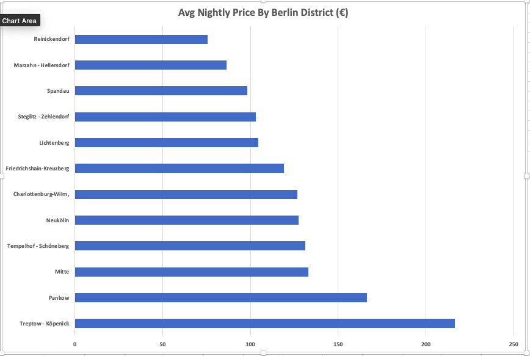
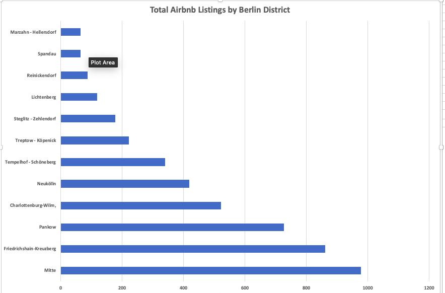
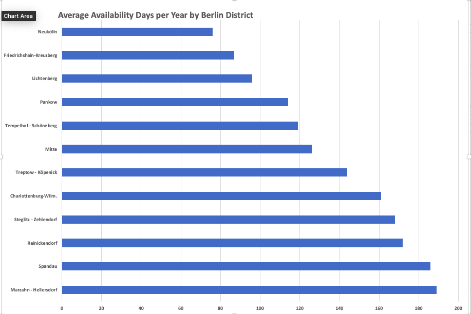
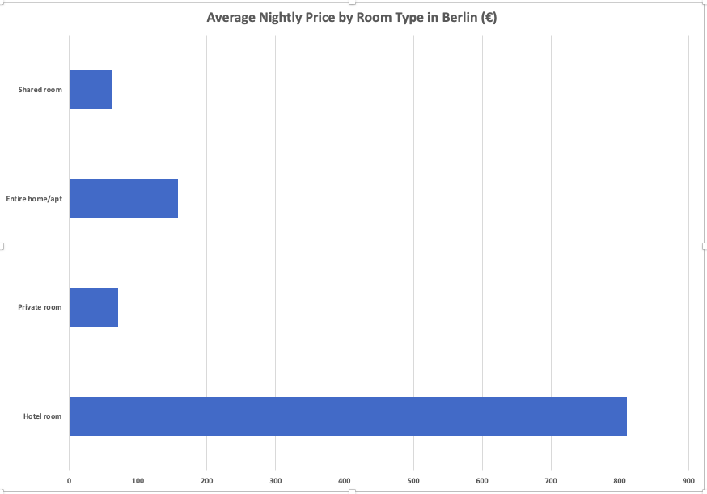

 Berlin Airbnb Listings Analysis

 Project Overview
 Analysis of 14,319 Berlin Airbnb listings using SQL and Excel to uncover pricing trends, demand patterns, and investment 
 opportunities across Berlin districts.

 Tools Used
- SQL (SQLiteOnline)
- Microsoft Excel

 Dataset
- Source: Inside Airbnb (insideairbnb.com)
- Records: 14,319 listings
- City: Berlin, Germany
- Period: Up to March 2026

 Business Questions Answered
1. Which Berlin districts have the highest average prices?
2. Which room type is most common and highest priced?
3. Which districts have the most listings?
4. Which districts have highest demand based on availability?
5. Which districts receive the most guest reviews?
6. How does pricing strategy differ by room type?

 Key Findings
- Treptow-Köpenick is the most expensive district at €216/night
- Entire homes dominate supply with 3,346 listings at €157 avg
- Mitte has the most listings with 977 but mid-range prices
- Neukölln is most booked with only 76 availability days per year
- Lichtenberg has highest avg reviews per listing at 43.58
- Entire homes require avg 45 night minimum — reflecting Berlin's strict short term rental regulations

Charts

 Files
- berlin_airbnb_queries.sql — All SQL queries used
- berlin_airbnb_analysis.xlsx — Excel charts and analysis

 Insights
Full written insights for each analysis are included 
in the Excel file.
